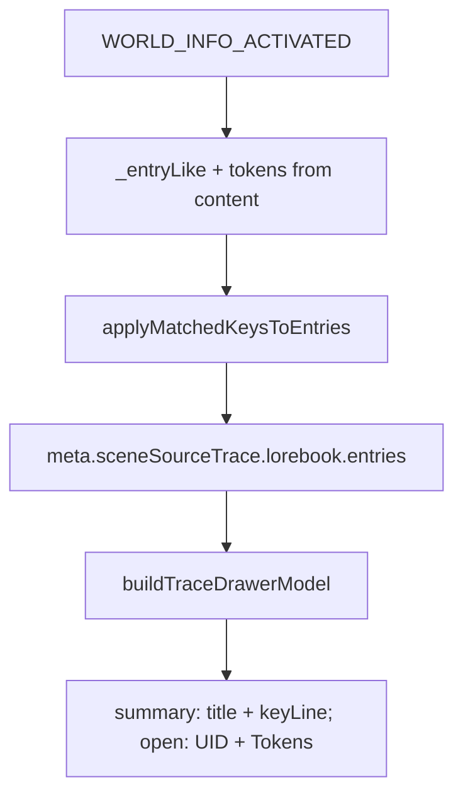

# Source Trace Row UI Implementation Plan

> **For agentic workers:** REQUIRED SUB-SKILL: Use superpowers:subagent-driven-development (recommended) or superpowers:executing-plans to implement this plan task-by-task. Steps use checkbox (`- [ ]`) syntax for tracking.

**Goal:** В Lore drawer показывать запись двустрочно (title + key) без имени лорбука, при раскрытии — UID и оценку токенов, без горизонтального overflow.

**Architecture:** При `WORLD_INFO_ACTIVATED` считать `tokens = Math.round(content.length / 4)` и сохранять только число в trace entry (без `content`). UI model отдаёт `title` + `keyLine` вместо однострочного `world — title — keys`; summary рендерит две строки, expanded `.sp-source-trace-row` — UID и Tokens. Мир остаётся только в заголовке группы `.sp-source-trace-world-title`.

**Tech Stack:** Vanilla JS ES modules, CSS в `css/scene-source-trace.css`, Node `.mjs` tests.

## Global Constraints

- Оценка токенов: `Math.round(String(content).length / 4)` — тот же heuristic, что в interceptor/pipeline.
- В snapshot **не** писать полный `content` lorebook entry — только `tokens` (integer ≥ 0). Если content пустой/отсутствует → `tokens: 0`.
- Старые snapshot без `tokens`: в drawer показывать `—`.
- Группировка по `world` не меняется.
- Regex keys по-прежнему не показываются как сырой паттерн: в key line только `matchedKeys` (как сейчас), для `constant` → `{ constant }`, для пустых → `{ — }`.
- Локали: label `Tokens` уже есть в `t('Tokens')`; новые UI-строки не обязательны, если литералы `UID` / `key -` остаются как сейчас (`UID` уже hardcoded).

## Chosen UI contract

Collapsed summary (то, что пользователь назвал «sp-source-trace-row» — видимая строка записи; класс контейнера остаётся `.sp-source-trace-entry`):

```text
Lancer-class Servant
key - { Artoria Pendragon, Артория Пендрагон Лансер }
```

Expanded `.sp-source-trace-row`:

```text
UID
9
Tokens
~12
```



## File Structure

| File | Responsibility |
|------|----------------|
| Modify [`src/scene-source-trace.js`](../../../src/scene-source-trace.js) | Extract content length → `tokens`; pass through normalize / apply / finish |
| Modify [`src/ui/scene-source-trace-ui.js`](../../../src/ui/scene-source-trace-ui.js) | Title/key formatters, model fields, HTML for 2-line summary + Tokens meta |
| Modify [`css/scene-source-trace.css`](../../../css/scene-source-trace.css) | Two-line summary + overflow containment |
| Modify [`tests/scene-source-trace.test.mjs`](../../../tests/scene-source-trace.test.mjs) | Capture tokens + new line/HTML assertions |
| Create [`docs/superpowers/plans/2026-07-25-source-trace-row-ui.md`](2026-07-25-source-trace-row-ui.md) | Copy of this plan for the repo plans folder |

---

### Task 1: Persist token estimate at capture

**Files:**
- Modify: [`src/scene-source-trace.js`](../../../src/scene-source-trace.js) (`_entryLike`, `applyMatchedKeysToEntries`)
- Test: [`tests/scene-source-trace.test.mjs`](../../../tests/scene-source-trace.test.mjs)

**Interfaces:**
- Produces: each normalized/finished entry includes `tokens: number` (integer ≥ 0)
- Consumes: `content` / `entry.content` from WI payload only for length; discarded after estimate

- [x] **Step 1: Write the failing test**
- [x] **Step 2: Run test to verify it fails**
- [x] **Step 3: Minimal implementation**
- [x] **Step 4: Run tests — pass**
- [x] **Step 5: Commit**

### Task 2: Two-line model + drawer HTML (no world in entry)

**Files:**
- Modify: [`src/ui/scene-source-trace-ui.js`](../../../src/ui/scene-source-trace-ui.js)
- Test: [`tests/scene-source-trace.test.mjs`](../../../tests/scene-source-trace.test.mjs)

**Interfaces:**
- Consumes: `entry.tokens`, `entry.title`, `entry.matchedKeys`, `entry.matchKind`
- Produces:
  - `formatTraceEntryTitle(entry) → string`
  - `formatTraceEntryKeyLine(entry) → string` like `key - { a, b }` / `key - { constant }` / `key - { — }`
  - `formatTraceEntryLine(entry)` kept as thin helper: title + key line (no world)
  - `buildTraceDrawerModel` item: `{ title, keyLine, uid, tokens, matchedKeys, matchKind }`

- [x] **Step 1: Write failing tests**
- [x] **Step 2: Run — expect FAIL**
- [x] **Step 3: Implement formatters + model + mount HTML**
- [x] **Step 4: Run tests — PASS**
- [x] **Step 5: Commit**

### Task 3: CSS overflow + two-line layout

**Files:**
- Modify: [`css/scene-source-trace.css`](../../../css/scene-source-trace.css)

- [x] **Step 1: Update CSS**
- [x] **Step 2: Manual check** — narrow panel / long Russian key: no horizontal scroll of page; text wraps inside drawer.
- [x] **Step 3: Commit**

### Task 4: Save plan copy + smoke

**Files:**
- Create: [`docs/superpowers/plans/2026-07-25-source-trace-row-ui.md`](2026-07-25-source-trace-row-ui.md)

- [x] **Step 1:** Write this plan into that path.
- [x] **Step 2:** Run `node tests/scene-source-trace.test.mjs` — all pass.
- [x] **Step 3: Commit** plan file if not already committed with earlier tasks.

## Spec coverage (self-check)

1. Tokens on expand → Task 1 + Task 2 expanded meta
2. No overflow → Task 3
3. Remove lorebook from entry name → Task 2 (`formatTraceEntryTitle` / no world in summary)
4. Two-line title + `key - { … }` → Task 2 + Task 3
