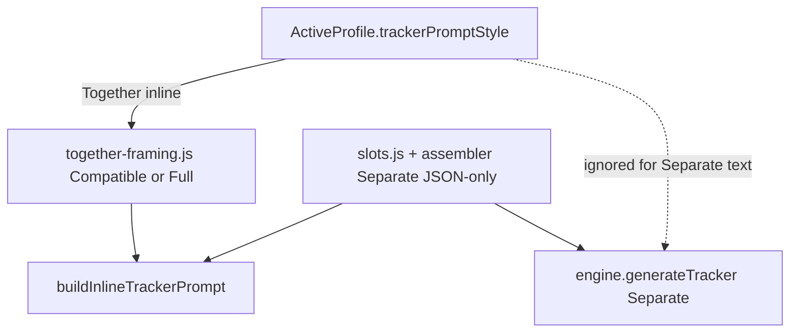

# Tracker Prompt Style Implementation Plan

> **For agentic workers:** REQUIRED SUB-SKILL: Use superpowers:subagent-driven-development (recommended) or superpowers:executing-plans to implement this plan task-by-task. Steps use checkbox (`- [ ]`) syntax for tracking.

**Goal:** Replace the weak Together-mode framing and thin Separate critical rules with Marinara/FF-style priority rules, anti-omniscient/delta discipline, Compatible vs Full prompt styles, and a profile UI toggle — while keeping dynamic field specs, quest rules, and model presets intact.

**Architecture:** Together mode keeps assembling field specs via `getActivePrompt()` / slots, but wraps them in a new framing module (`src/prompts/together-framing.js`) selected by `profile.trackerPromptStyle` (`compatible` default, `full` optional). Separate mode stays JSON-only (no narrative+tracker dual-write) and always uses strengthened Full-intensity `criticalRules` / `deltaMode` slot defaults. Built-in model presets that override `role` for chat templates are left alone.

**Tech Stack:** Vanilla JS ES modules (SillyTavern extension), jQuery settings UI, Node `.mjs` tests under `tests/`.

**Target branch:** `experimental`

**Approved spec:** [`docs/superpowers/specs/2026-07-25-tracker-prompt-style-design.md`](../specs/2026-07-25-tracker-prompt-style-design.md)

## Global Constraints

- Branch: work and commits land on `experimental` only.
- Do not break marker contract: `<!--SP_TRACKER_START-->` / `<!--SP_TRACKER_END-->` from `src/generation/extraction.js`.
- Do not replace model-preset `role` jailbreaks in `src/presets/built-in.js` with Together narrative framing.
- Legacy `profile.systemPrompt` full override still wins in assembler; do not silently rewrite user-authored legacy prompts — surface a short editor hint that Compatible/Full framing applies only when slots are used.
- Compatible = Together default; Separate always uses Full-intensity Separate slot text.
- VAD mood/tension: Full Together framing + Separate `criticalRules`; not in Compatible Together.
- Handover / end-on-question: hard ban in Compatible and Full.
- Anti-omniscient vs prevState: dual-rule (prevState = continuity only; new facts/meters from THIS response only).
- Always-include / mandatoryHints: explicit carve-out; do not weaken interceptor lists.
- Continuation recovery in `engine.js` is in scope (JSON-only, dual-rule tightened).
- Prompt bodies are English source strings; new UI labels: English `t()` / `locales/_source.json` + Russian in `locales/russian.json` only.

## Design decisions (brainstorming)

- **Approach:** Keep architecture; revise prompt wording and coverage gaps.
- **Handover / end-on-question:** Hard ban (A).
- **Anti-omniscient vs prevState:** Dual-rule (A).
- **Always-include carve-out:** Explicit carve-out (A).
- **Continuation recovery:** In scope (A).
- **Locales:** English + Russian only (C).

## File Structure

| File | Responsibility |
|------|----------------|
| Create `src/prompts/together-framing.js` | Compatible/Full Together rule blocks + helpers |
| Modify `src/generation/interceptor.js` | Consume framing; update head/tail anchors |
| Modify `src/prompts/slots.js` | Strengthen Separate `criticalRules` (+ light `deltaMode` anti-repeat) |
| Modify `src/generation/engine.js` | Continuation recovery user prompt: dual-rule + no fences/commentary |
| Modify `src/profiles.js` | `trackerPromptStyle` on `PROFILE_FIELDS` + `makeProfile` |
| Modify `src/settings-ui/create-settings.js` + `bind-ui.js` | Profile UI select |
| Modify `locales/_source.json` + `locales/russian.json` | UI strings for Tracker Prompt Style |
| Create `tests/together-framing.test.mjs` | Style selection + required phrases |
| Modify `tests/inline-thought-prompt.test.mjs`, `tests/prompt-assembler.test.mjs` | Regression |
| Create `docs/superpowers/backups/2026-07-25-tracker-prompts/` | Snapshot of pre-change framing/slot strings |



---

### Task 0: Backup current prompt sources on experimental

**Files:**
- Create: `docs/superpowers/backups/2026-07-25-tracker-prompts/slots-criticalRules.txt`
- Create: `docs/superpowers/backups/2026-07-25-tracker-prompts/interceptor-inline-framing.txt`

- [ ] **Step 1:** Copy current `_CRITICAL_RULES` / `_DELTA_MODE` from `src/prompts/slots.js` and the string templates from `buildInlineTrackerPrompt()` + head/tail `mes` strings from `src/generation/interceptor.js` into the backup folder.
- [ ] **Step 2:** Confirm this plan file exists at `docs/superpowers/plans/2026-07-25-tracker-prompt-style.md`.
- [ ] **Step 3: Commit**

```bash
git add docs/superpowers/backups/2026-07-25-tracker-prompts docs/superpowers/plans/2026-07-25-tracker-prompt-style.md docs/superpowers/specs/2026-07-25-tracker-prompt-style-design.md
git commit -m "$(cat <<'EOF'
docs: backup tracker prompts and add Compatible/Full design+plan

EOF
)"
```

---

### Task 1: Together framing module (Compatible + Full)

**Files:**
- Create: `src/prompts/together-framing.js`
- Test: `tests/together-framing.test.mjs`

**Interfaces:**
- Produces:
  - `export const TRACKER_PROMPT_STYLES = ['compatible', 'full']`
  - `export function normalizeTrackerPromptStyle(value) => 'compatible' | 'full'` (anything else → `'compatible'`)
  - `export function getTogetherRulesBlock(style) => string`
  - `export function getTogetherOutputFormatBlock({ isDelta, deltaAlways, deltaExample, fieldList }) => string`

**Compatible rules text (exact constant to ship):**

```text
<tracker_instructions>
You are simultaneously writing a roleplay response AND maintaining a structured scene tracker.

RULES (strict priority order):
1. First write the complete narrative response according to all other instructions in the prompt.
2. ONLY AFTER the narrative is fully finished, append the tracker block.
3. Never mix any tracker data, field names, JSON keys, or system notes into the narrative text.
4. Never mention the tracker, JSON, markers, or these instructions in the story.
5. The tracker block is invisible to the user and must not influence the story tone.
6. Never end the narrative on a handover cue or a question that expects an immediate reply right before the tracker block.

ANTI-OMNISCIENT & DELTA RULES:
- Use PREVIOUS STATE only for continuity: reuse canonical names/aliases and carry durable facts that did not change. Do not treat previous tracker values as license to invent new story facts.
- New facts, events, and meter/relationship/physical changes: only from what was explicitly shown, stated, or clearly demonstrated in THIS response.
- Do not invent or assume from character cards, world info, or unreferenced history.
- Report ONLY fields that actually changed or became newly relevant this turn — EXCEPT ScenePulse always-include fields, WHEN INCLUDING / MANDATORY FIELDS hints, and any delta always-include list in this prompt (those override omit-unchanged).
- If a category has no meaningful change — omit the field (delta) or use null/empty/[] as appropriate (full).
- Ban semantic re-skinning of the same information.
- Do not repeat, rephrase, or re-describe information that was already present in the previous tracker snapshot unless it truly changed.
- Only record relationship or physical changes that actually occurred and were fully executed in the narrative (no hovering or incomplete actions).
- Mood, tension, and relationship meters must reflect visible/behavioral evidence from this response only.
</tracker_instructions>
```

**Full rules text:** Compatible text plus these extra bullets inside the same `<tracker_instructions>` block (after anti-omniscient rules):

```text
- Ban repeating distinctive phrases, sensory details, or character descriptions that appeared in the last 3–4 responses unless they have meaningfully changed.
- Prefer visible/behavioral scene changes over unspoken thoughts when assigning mood, tension, and relationship meters.
- When updating mood and tension, consider three axes: Valence (positive/negative), Arousal (high/low energy), Dominance (in control/helpless). Reflect the dominant combination in the values you assign.

INTERNAL REASONING (do this silently before writing the JSON):
- What actually changed in the scene this turn?
- Which characters are currently present and relevant?
- Did any relationships, quests, mood, tension, location, or environment shift?
```

**Shared OUTPUT FORMAT helper** (appended by `getTogetherOutputFormatBlock`):

```text
OUTPUT FORMAT (mandatory):
After the narrative, output EXACTLY this and nothing else:

<!--SP_TRACKER_START-->
{valid JSON here}
<!--SP_TRACKER_END-->

- No explanations, no commentary, no extra text before or after the markers.
- Do not wrap the JSON in markdown code blocks.
- The tracker block does not count toward any response length limits.
```

For delta turns, replace `{valid JSON here}` guidance with the existing delta always-include / example pattern currently inlined in `buildInlineTrackerPrompt` (`deltaAlways`, `deltaExample`). For full turns, keep `Required keys: ${fieldList}` immediately above the markers.

- [ ] **Step 1: Write the failing test**

```js
// tests/together-framing.test.mjs
import { normalizeTrackerPromptStyle, getTogetherRulesBlock } from '../src/prompts/together-framing.js';
assert.equal(normalizeTrackerPromptStyle('full'), 'full');
assert.equal(normalizeTrackerPromptStyle('nope'), 'compatible');
const compat = getTogetherRulesBlock('compatible');
assert.ok(compat.includes('ANTI-OMNISCIENT'));
assert.ok(!compat.includes('INTERNAL REASONING'));
assert.ok(!compat.includes('Valence'));
const full = getTogetherRulesBlock('full');
assert.ok(full.includes('INTERNAL REASONING'));
assert.ok(full.includes('Valence'));
```

- [ ] **Step 2: Run test to verify it fails**

Run: `node tests/together-framing.test.mjs`  
Expected: FAIL (module missing)

- [ ] **Step 3: Write minimal implementation**

Implement `src/prompts/together-framing.js` with the constants above.

- [ ] **Step 4: Run test to verify it passes**

Run: `node tests/together-framing.test.mjs`  
Expected: PASS

- [ ] **Step 5: Commit**

```bash
git add src/prompts/together-framing.js tests/together-framing.test.mjs
git commit -m "feat: add Compatible/Full Together tracker framing module"
```

---

### Task 2: Wire framing into Together interceptor + head/tail

**Files:**
- Modify: `src/generation/interceptor.js` (`buildInlineTrackerPrompt` ~105–262, head/tail ~371–385)
- Modify: `tests/inline-thought-prompt.test.mjs`

**Interfaces:**
- Consumes: `normalizeTrackerPromptStyle`, `getTogetherRulesBlock`, `getTogetherOutputFormatBlock` from Task 1; `getActiveProfile(s).trackerPromptStyle`
- Keeps: `_cleanSnap`, `prevState` XML narrative-separation block, quest state rules, `mandatoryHints`, `fieldSpecs` strip of `## FIELD SPECIFICATIONS`, delta vs full branching via `shouldUseDelta`

**New `buildInlineTrackerPrompt` composition order:**

1. `getTogetherRulesBlock(style)`
2. Existing DELTA RULES / Required keys + `mandatoryHints` (preserve current deltaAlways / character full-entity rules). Immediately after delta/mandatory blocks, keep a one-line reminder that those lists override omit-unchanged from the framing rules.
3. `fieldSpecs`
4. language block + `prevState` (unchanged; continuity dual-rule already in framing)
5. `getTogetherOutputFormatBlock(...)` instead of the short “MANDATORY OUTPUT” paragraphs

**Head anchor replacement:**

```text
IMPORTANT: After your complete narrative, append tracker JSON between <!--SP_TRACKER_START--> and <!--SP_TRACKER_END-->. Do not put tracker data in the story. Full rules and schema appear later in the context.
```

**Tail anchor replacement:**

```text
End with <!--SP_TRACKER_START-->{tracker JSON}<!--SP_TRACKER_END--> only — no markdown fences, no commentary after the end marker. Do not repeat these instructions in the narrative.
```

- [ ] **Step 1: Write the failing test**

Extend `inline-thought-prompt.test.mjs` to set `active.trackerPromptStyle='full'` and assert prompt includes `INTERNAL REASONING` and `SP_TRACKER_START`; with `'compatible'` assert no `INTERNAL REASONING`.

- [ ] **Step 2: Run test to verify it fails**

Run: `node tests/inline-thought-prompt.test.mjs`  
Expected: FAIL until interceptor wired

- [ ] **Step 3: Write minimal implementation**

Implement interceptor wiring; do not delete quest/prevState/mandatoryHints logic.

- [ ] **Step 4: Run test to verify it passes**

Run: `node tests/inline-thought-prompt.test.mjs` and `node tests/together-framing.test.mjs`  
Expected: PASS

- [ ] **Step 5: Commit**

```bash
git add src/generation/interceptor.js tests/inline-thought-prompt.test.mjs
git commit -m "feat: apply Compatible/Full framing in Together interceptor"
```

---

### Task 3: Strengthen Separate-mode slot defaults (Full intensity)

**Files:**
- Modify: `src/prompts/slots.js` `_CRITICAL_RULES`, append bullet to `_DELTA_MODE`
- Modify: `tests/prompt-assembler.test.mjs`

**Keep Separate identity:** role stays “JSON OUTPUT ONLY / raw JSON only — no prose”. Do **not** paste Together `<tracker_instructions>` narrative dual-write into Separate.

**Replace `_CRITICAL_RULES` with:**

```text
## CRITICAL RULES
1. Populate scalar and object fields with concise, evidence-based values. Use [] for genuinely empty array fields; never invent filler entries just to make an array non-empty.
2. Output must be valid parseable JSON. No trailing commas, no comments. Do not wrap JSON in markdown code blocks. No explanations before or after the JSON.
3. Carry durable facts forward when unchanged. NEVER carry charactersPresent, witnesses, innerThought, or immediateNeed forward by default: recompute them from THIS turn. If nobody qualifies for a volatile array, output [].
4. ANTI-OMNISCIENT: Previous snapshot is continuity only (names/aliases/unchanged durable facts). New facts and meter changes must be evidenced in this turn's scene text. Do not invent from character cards, world info, or unreferenced history.
5. Do not repeat, rephrase, or re-describe information already present in the previous tracker snapshot (ban semantic re-skinning).
6. Only record relationship or physical changes that actually occurred and were fully executed in the narrative. Mood, tension, and relationship meters must reflect visible/behavioral evidence from this turn only.
7. When updating mood and tension, consider Valence, Arousal, and Dominance; reflect the dominant combination.
```

Append to `_DELTA_MODE` after existing item 9:

```text
10. Ban repeating distinctive phrases or character descriptions from recent context unless they meaningfully changed this turn.
```

- [ ] **Step 1: Write the failing test**

Add assembler assertions that assembled prompt (no legacy `systemPrompt`) includes `ANTI-OMNISCIENT` and `Valence`.

- [ ] **Step 2: Run test to verify it fails**

Run: `node tests/prompt-assembler.test.mjs`  
Expected: FAIL

- [ ] **Step 3: Write minimal implementation**

Update slot defaults.

- [ ] **Step 4: Run test to verify it passes**

Run: `node tests/prompt-assembler.test.mjs`  
Expected: PASS

- [ ] **Step 5: Commit**

```bash
git add src/prompts/slots.js tests/prompt-assembler.test.mjs
git commit -m "feat: strengthen Separate tracker criticalRules with Full anti-rules"
```

---

### Task 3b: Continuation recovery prompt (`engine.js`)

**Files:**
- Modify: `src/generation/engine.js` ~560–576 (continuation user prompt + `prevState` label)
- Test: extend an existing generation/continuation test if present; otherwise extract a small string helper for testability and assert phrasing

**Change:**
- Relabel prevState line to continuity dual-rule (not unlimited “carry forward”).
- After “Output ONLY the tracker JSON…”, add 2–3 bullets: continuity-only prevState; new facts/meters from this narrative only; no markdown fences / no commentary.

- [ ] **Step 1: Write the failing test** (or extract helper + assert)
- [ ] **Step 2: Run test to verify it fails**
- [ ] **Step 3: Tighten continuation prompt strings** (keep JSON-only, no markers)
- [ ] **Step 4: Run test to verify it passes**
- [ ] **Step 5: Commit**

```bash
git add src/generation/engine.js tests/
git commit -m "feat: tighten Together continuation recovery prompt rules"
```

---

### Task 4: Profile field + UI toggle

**Files:**
- Modify: `src/profiles.js` — add `'trackerPromptStyle'` to `PROFILE_FIELDS`; in `makeProfile` set `trackerPromptStyle: normalizeTrackerPromptStyle(partial.trackerPromptStyle)`
- Modify: `src/settings-ui/create-settings.js` — under Prompts tab Profile section, after active profile controls:

```html
<div class="sp-fs" style="margin-top:6px">
  <label>${t('Tracker Prompt Style')}</label>
  <select id="sp-tracker-prompt-style">
    <option value="compatible">${t('Compatible (short — best with heavy presets)')}</option>
    <option value="full">${t('Full (detailed + silent reasoning)')}</option>
  </select>
</div>
<div class="sp-hint">${t('Together mode only. Compatible is the default and minimizes conflict with heavy jailbreaks (Marinara, Freaky Frankenstein, etc.). Full adds VAD mood guidance and silent reasoning. Separate mode always uses the detailed JSON analysis rules.')}</div>
```

- Modify: `src/settings-ui/bind-ui.js` — load/save via `updateActiveProfile({ trackerPromptStyle })` on change; refresh on profile switch; profile-only (not root `DEFAULTS`).
- Locales: add keys to `locales/_source.json` and Russian translations in `locales/russian.json` only.

**Default:** `'compatible'`.

- [ ] **Step 1: Write the failing test** — `makeProfile({})` → `trackerPromptStyle === 'compatible'`; `makeProfile({ trackerPromptStyle: 'full' })` → `'full'`.
- [ ] **Step 2: Run test to verify it fails**
- [ ] **Step 3: Implement profile + UI wiring + locales**
- [ ] **Step 4: Run tests / smoke `buildInlineTrackerPrompt()` with both styles**
- [ ] **Step 5: Commit**

```bash
git add src/profiles.js src/settings-ui/create-settings.js src/settings-ui/bind-ui.js locales/_source.json locales/russian.json tests/
git commit -m "feat: add per-profile Tracker Prompt Style Compatible/Full toggle"
```

---

### Task 5: Legacy-prompt editor hint + regression sweep

**Files:**
- Modify: `src/ui/prompt-editor.js` — if `profile.systemPrompt` truthy, extend existing legacy banner: “Compatible/Full Together framing and updated Separate slot defaults apply only after you Clear legacy system prompt.”

- [ ] **Step 1: Update legacy banner copy**
- [ ] **Step 2: Run regression suite**

```bash
node tests/together-framing.test.mjs
node tests/inline-thought-prompt.test.mjs
node tests/prompt-assembler.test.mjs
node tests/issue-16-prompt-role.test.mjs
node tests/preset-registry.test.mjs
```

Expected: all PASS

- [ ] **Step 3: Fix any assertion drift**
- [ ] **Step 4: Commit**

```bash
git add src/ui/prompt-editor.js
git commit -m "fix: clarify legacy systemPrompt vs Tracker Prompt Style"
```

---

## Spec coverage (self-review)

| Spec stage | Task |
|------------|------|
| Backup | Task 0 |
| Together framing Compatible/Full | Tasks 1–2 |
| Dual-rule / carve-out / hard handover ban | Task 1 constants + Task 2 |
| Separate Full criticalRules | Task 3 |
| Continuation recovery | Task 3b |
| Profile UI + locales EN/RU | Task 4 |
| Legacy banner + regression | Task 5 |

**Out of scope:** Rewriting built-in preset `role` overrides; Separate narrative+JSON dual-write; third prompt style; all-locales translation.

**Prompt text source of truth:** Constants in Tasks 1 and 3 above.
